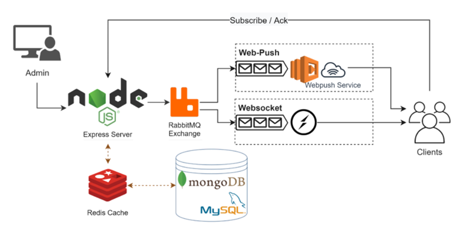
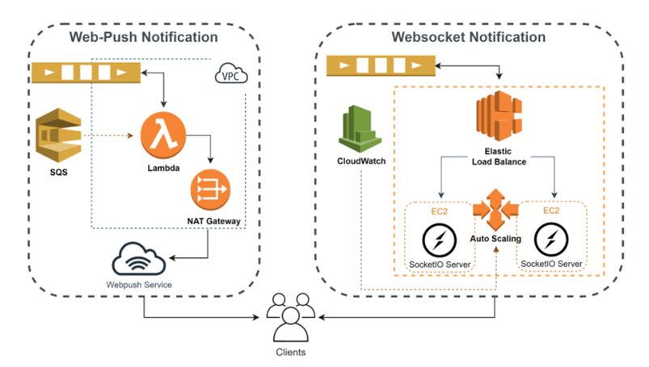
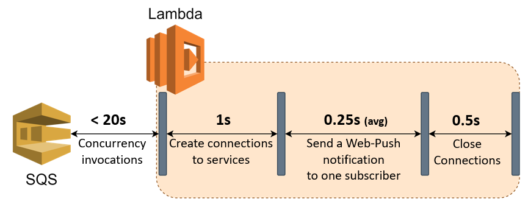
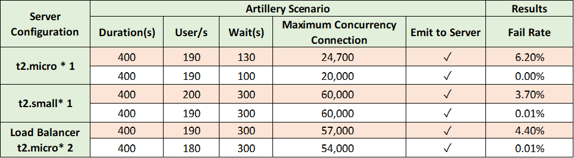
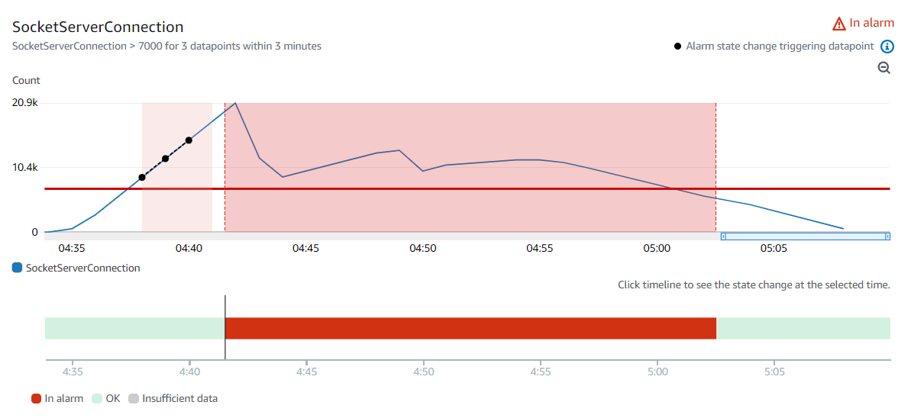
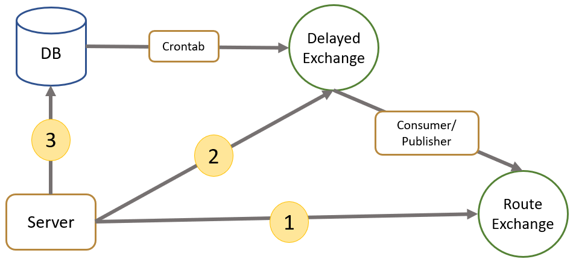
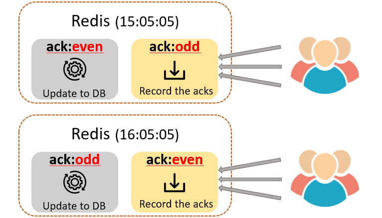
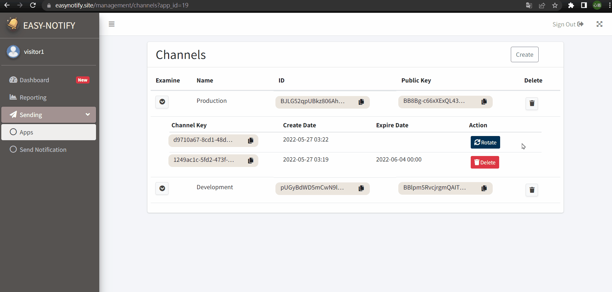
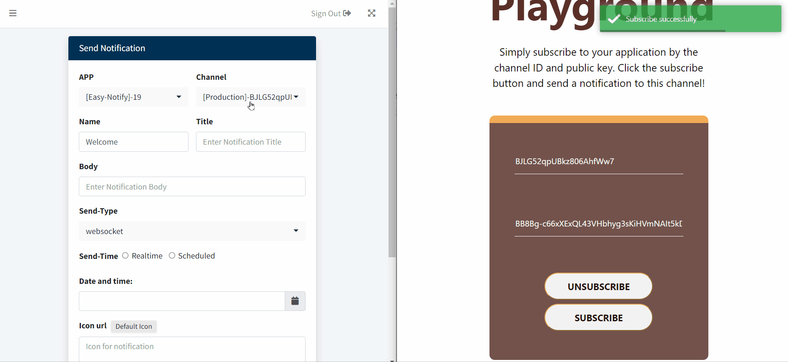
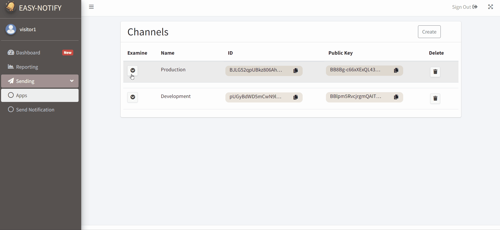

# Easy-Notify
Easy-Notify is a handy push notification service that enables developer to easily send and manage notifications via RESTful API and a management console. A Front-End NPM library, <a href="https://github.com/hsintzuli/EasyNotify-Client" target="_blank">EasyNotify-Client</a>, is provided for receiving the push notifications.  

--------------  

## Table of contents 
1. [External Links and Test Account](#external-links-and-test-account)
2. [Features](#features)
3. [Techniques](#techniques)
   - [Brief Architecture](#-brief-architecture)
   - [Architecture of Web-Push Notification and WebSocket Notification](#-architecture-of-web-push-notification-and-websocket-notification)
     - [Scale Out Web-Push Worker by Using AWS Lambda](#Scale-Out-Web-Push-Worker-by-Using-AWS-Lambda)
     - [Scalability of Socket.IO Server](#Scalability-of-Socket.IO-Server)
   - [Mechanism of Sending and Tracking Notification](#-Mechanism-of-Sending-and-Tracking-Notification)
     - [Schedule Notification with Crontab and RabbitMQ](#-Schedule-Notification-with-Crontab-and-RabbitMQ)
     - [Record the ACK Response on Redis](#-Record-the-ACK-Response-on-Redis)</a>  
4. [Demo](#demo)
   - [Home Page](#home-page)
   - [Subscribe to Your Channel on the Demo Website](#subscribe-to-your-channel-on-the-demo-website)
   - [Send A Web-Push Notification in Console](#send-a-web-push-notification-in-console)
   - [Key-Rotate](#key-rotate)
5. [Contact](#contact)

--------------  

## External Links and Test Account
### Links
- <a href="https://easynotify.site/" target="_blank">Easy-Notify Website</a> : Main website to sign up, manage Apps, and send notifications
- <a href="https://demo.easynotify.site/" target="_blank">Demo Website Website</a> : Website for tests by subscribing to your own channel
- <a href="https://github.com/hsintzuli/EasyNotify-Client" target="_blank">EasyNotify-Client GitHub</a> : Front-End library for receiving the notifications that are pushed to your channel
- <a href="https://www.npmjs.com/package/easy-notify-client" target="_blank">EasyNotify-Client NPM</a> : Link to the Front-End library in NPM
- <a href="https://app.swaggerhub.com/apis-docs/nnjkm076017/EasyNotify/1.0" target="_blank">Swagger API document</a> : API document about sending notification  

### Test Account

User        | Email | Password |
----------- | ----  | ---  |
visitor1    | visitor1@easynotify.com | visitor1 |
visitor2    | visitor2@easynotify.com | visitor2 |

_Note: After experiencing the service of Easy-Notify on Demo website with the test account, remember to click the unsubscribe button or you may keep receiving the test notifications from others._  

--------------  
## Features
- Send real-time/scheduled notifications by Web-Push or WebSocket
   - Web-Push : Need the authorization of your clients and let them receive messages even though your web app is not in the foreground. **Re-engage your clients with Web-Push notifications!**
   - WebSocket : Do not need the clients' authorization but only appears on your website. **Notify all the visitors landing on your website with upcoming activities by WebSocket!**
- Create channels for each App to further separate the environment
- Track the status and delivered rate of all the notifications
- Capture the tendency of the numbers of subscribers
- Send notifications with customize configuration
- Quickly get start with fully documented NPM library for Front-End and demo website
- Scalable architecture for users with thousands of subscribers 

--------------
## Techniques  
### 🔍 Brief Architecture

  

 

### 🔍Architecture of Web-Push Notification and WebSocket Notification

  

   

#### Scale Out Web-Push Worker by Using AWS Lambda      <a align='right' href="./docs/webpush-lambda.md" target="_blank">  📋Read More</a>
The concurrency executions of the AWS Lambda function enable Easy-Notify to send notifications to at least **1,200 * 20** subscribers in 15 minutes. At the same time, the exact number could be more extensive than 24,000 because of the maximum 1,000 concurrency executions of the AWS Lambda function.

  

  
  
#### Scalability of Socket.IO Server      <a align='right' href="./docs/socketio-scaling.md" target="_blank">  📋Read More</a>

##### **Load Test on Vertical Scaling and Horizontal Scaling**
Vertical Scaling is capable of maintaining a higher maximum concurrency connection than Horizontal Scaling.  

  

  

##### **Auto Scaling by AWS Application Load Balancer**
ALB successfully scaled out the auto scaling groups after the concurrency connections reached approximately 21,000. 

  

  

### Mechanism of Sending and Tracking Notification  
#### Schedule Notification with Crontab and RabbitMQ      <a align='right' href="./docs/notification-related_mechanism.md/#three-cases-of-notifications" target="_blank">  📋Read More</a>
Three cases of notifications

  

#### Record the ACK Response on Redis    <a align='right' href="./docs/notification-related_mechanism.md/#record-ack-response-on-redis" target="_blank">  📋Read More</a>
Rotate two HashMaps on Redis to record the ack responses from subscribers

  

--------------
## Demo
### 🔍 Home Page  
Click Get Started to sign up a new account and follow the instruction in Demo page to quickly experience Easy-Notify

 

### 🔍 Subscribe to Your Channel on the Demo Website
Subscribe your own channel on Demo Website by the Channel ID and Channel Key

 

### 🔍 Send a Web-Push Notification in Console
Send a Web-Push notification to the channel you subscribed in console and checkout the notification on the Demo Website 

 

### 🔍 Key-Rotate
In addition to create Apps and Channels, you can also rotate the Channel Key to enhance the security of your account

 

---------------
## Contact
Email: hsintzuli719@gmail.com