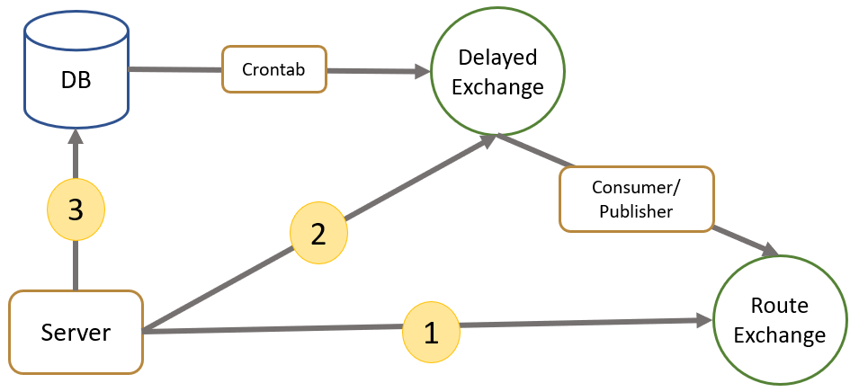

## Mechanism of scheduled notification
 

### **Three cases of notifications:**

1. Realtime notifications:  
Directly put the notification into RabbitMQ Exchange and deliver to Web-Push/WebSocket queue by routing key.
2. Notifications that is Scheduled in 6 hours:  
Put into RabbitMQ Delayed Message Exchange and transfer to RabbitMQ Exchange when the time is up
3. Notifications that is Scheduled Exceed 6 hours from Now:  
Let a crontab worker to examine whether there are notifications in the database should be put into RabbitMQ Delayed Message.
--------
 

## Record ACK response on Redis without Race Condition
 

### **Rotate two HashMaps on Redis to record the ack responses from subscribers:**
  
 

After a notification was sent via Easy-Notify, the EasyNotify-Client would make a request to Easy-Notify server as an ACK response to that notification. The numbers of the ACK responses would be recorded in MySQL, which enables users to track the delivered rate.

However, the ACK response would be a high-rate event and increase the write-load of MySQL. A Redis HashMap that can hold and aggregate the number is handy for this scenario. In addition, the rotate two HashMaps enable a crontab worker to update the numbers in Redis to MySQL in the background without worring about Race Condition.