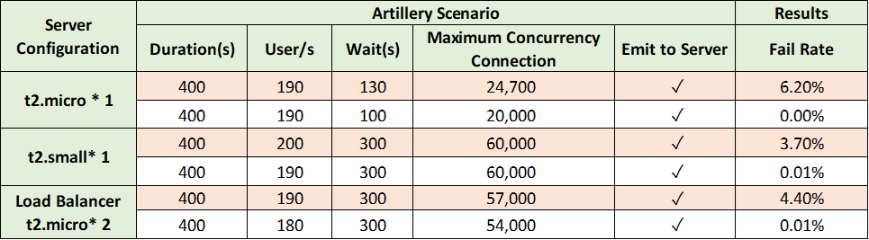
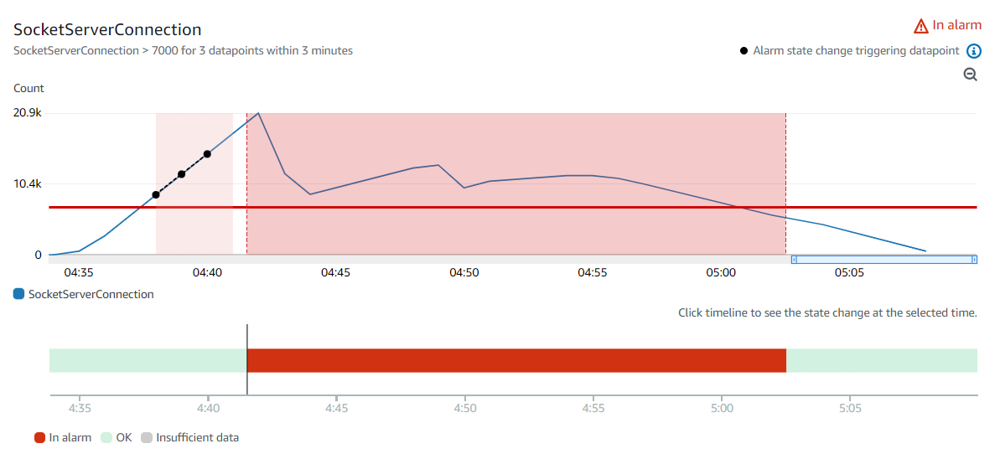

# Scalability of Socket.IO Server
To actively push notifications to the subscribers at any time, the Socket.IO server must keep the connections to all the online subscribers. As a result, the maximum concurrency connection that the Socket.IO server can maintain becomes an important indicator of the performance. The following tests mainly use ``the maximum concurrency connection`` as the measurement of scalability. 


## Load Test on Vertical Scaling and Horizontal Scaling  
### Test Circumstance
- **Tool :** Artillery
- **Test Machine  :** One t2.small EC2 in Singapore
- **Test Scenario :** Artillery will establish virtual clients every second and keep the connections for seconds. Each client will emit to the Socket.IO server for subscribing at 5 seconds after the connection is established.
- **Fail Rate :** numbers of WebSocket error / total connections  

_For example, the scenario, Duration(s): 400, User/s: 190, Wait(s): 130, means Artillery will create 190 virtual Socket.IO clients every second for 400 seconds, and each connection will last for 130 seconds. In this scenario, the maximum concurrent connections would be 24,700._

<br/> 

### Result  
Vertical Scaling is capable of maintaining a higher maximum concurrency connection than Horizontal Scaling.  
<p align="center">
  
</p>  

_Note:   
``white background``: the maximum concurrency connection that the server can maintain stably.  
``orange background``: the case that the server starts to error._  

## Auto Scaling by AWS Application Load Balancer
### Auto Scaling Policy - CloudWatch Alarm  
- **Custom Metrics :**  the numbers of connections of the Socket.IO server    
- **Metrics Update Frequency :** every minute   
- **Launch Target Configuration :** t2.micro       
- **Threshold :**   
The load test above shows that one t2.micro can maintain approximately 20,000 concurrency connections.  
```math 
 // 1 minute for launching new instances
20,000 - alarm > (4 × 60) * 50  
→ alarm < 8,000
```
**→ Socket.IO Connections > 7000 for 3 datapoints within 3 minutes**  


### Result 
<p align="center">
  
</p> 

ALB successfully scaled out the auto scaling groups after the concurrency connections reached approximately 21,000. 
<p align="center">
  
</p>  

_Note: The three dots are the datapoints that exceeded the threshold and triggered the scale alarm._  

### Conclusion
Because it took 4 - 5 minutes to trigger CloudWatch alarm and completely launch new instances, the Auto Scaling is more suitable for the case that there is no surge in the new clients.