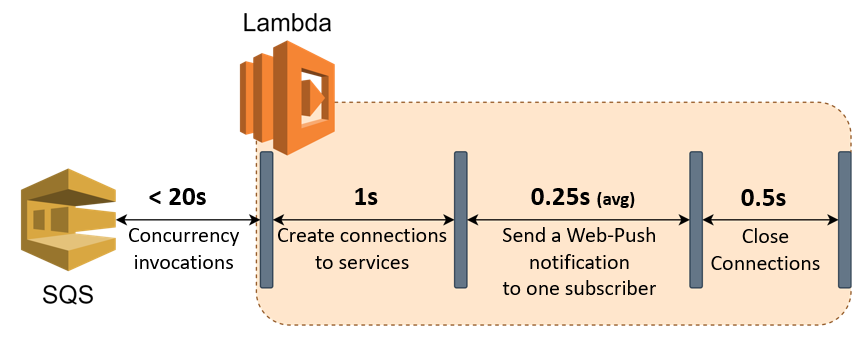

# Scale-Out Web-Push Worker by Using AWS Lambda
_Note: The introduction and example of Front-End configuration for Web-Push notification can be referred to <a href="https://github.com/hsintzuli/EasyNotify-Client" target="_blank">EasyNotify-Client</a>._   
<br/>

To handle the scenario that massive notifications flock to the server with thousands or more subscribers for each notification, this project used AWS Lambda as the Web-Push notification worker and configured AWS SQS as the trigger event. 
<br/>  


## Two tests for estimating the cost of time that use Lambda as the Web-Push worker
<p align="center">
  
</p>
<br/> 

1. The test of the concurrency invocations of Lambda function showed that 20 concurrency invocations could be done in 20 seconds.
2. The test of sending a notification to 6 subscribers in one Lambda function showed that the average cost of time send to one subscriber is 0.25 seconds.  

## The cost of time of each step
<p align="center">
  
</p>  

_Note: The services include Redis, MySQL, MongoDB, and RabbitMQ._ 
<br/> 


AWS Lambda functions are limited to running up for a maximum of 15 minutes per execution. To leave a buffer time for the connection to related services and the error of estimate, the estimated appropriate numbers of subscribers batched in one Lambda function would be 
``` math
8 min ÷ 0.25 second/subscriber =  1,200 subscribers  
```  

## Result
According to the results of the above tests, the concurrency executions of the AWS Lambda function enable Easy-Notify to send notifications to at least **1,200 * 20** subscribers in 15 minutes. At the same time, the exact number could be more extensive than 24,000 because of the maximum 1,000 concurrency executions of the AWS Lambda function.
 
